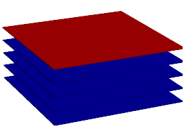

Algoritmos y Programación 2 - UNTREF

# Implementaciones de Pila

## Concepto

## Clase 

Material para la [Clase 10.1 Implementaciones de Pila](https://youtu.be/OkEtSAeqZEc)

## Estructura de datos

![Pila][pila]

[pila]: http://upload.wikimedia.org/wikipedia/commons/thumb/d/d1/Pila.svg/391px-Pila.svg.png "Pila"
